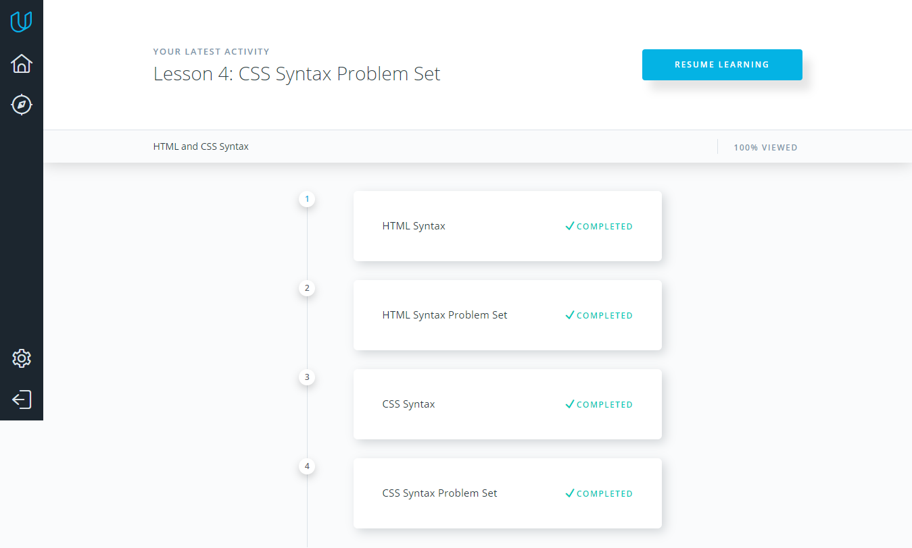
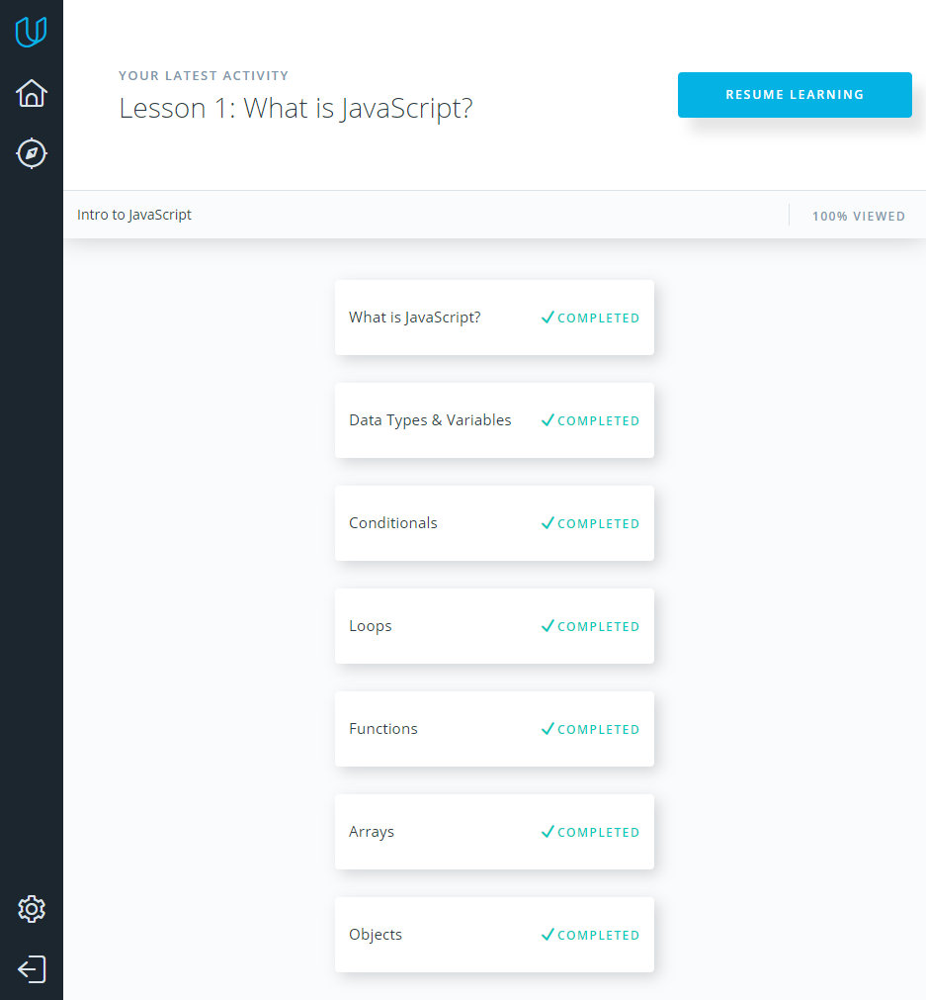

# Kottans Frontend Course
## Task 0 (get familiar with Git and GitHub)
**Here are my answers for three task questions:**
* New things that I have learned: making pull requests, git rebase command and working with local, remote repositories;
* The thing that surprised me was the capabilities of the git rebase;
* I think that in the future I will use the majority of git commands and github functionality, which I got acquainted with during the git courses.

### 1. How to use Git and GitHub:

### 2. try.github.io:

## Task 1
* I have learned a lot of new things, including networking and HTTP Protocol. Unfortunately, the information is hard to perceive without practical experience in this field;
* I was surprised about the amount of IP addresses in the network and -nc command;
* I think in the future I will often use linux command line and the knowledge I got about networks and HTTP Protocol.

### 1. Linux Command Line Basics:

### 2. Configuring Linux Web Servers:

### 3. Networking for Web Developers:

## Task 2
In my opinion, it was the most exciting Git course, mainly due to the interactivity and the way the information is organized.

### 1. What is Version Control:

### 2. GitHub & Collaboration:

## Task 3 (Intro to HTML & CSS)
The course gives very basic knowledge about HTML and CSS. To my mind, the course will be useful for beginners with no experience at all.

### HTML and CSS Syntax:

## Task 4 (Responsive Web Design Fundamentals)
* Responsive patterns and minor breakpoints were new for me;
* Most of all I liked the way of improving UX by providing minor breakpoint;
* I will definetly use the mobile-first responsive design concept.

### Responsive Web Design Fundamentals:

## Task 5 (Intro to Javascript)
* It's a nice course for javascript beginners. This course gave me better understanding of arrays, objects, callbacks, anonymous functions and forEach / map loops;
* Objects methods was very interesting for me;
* That's JS basics, so I will using this knowledge while JS-coding.

### Intro to Javascript:
