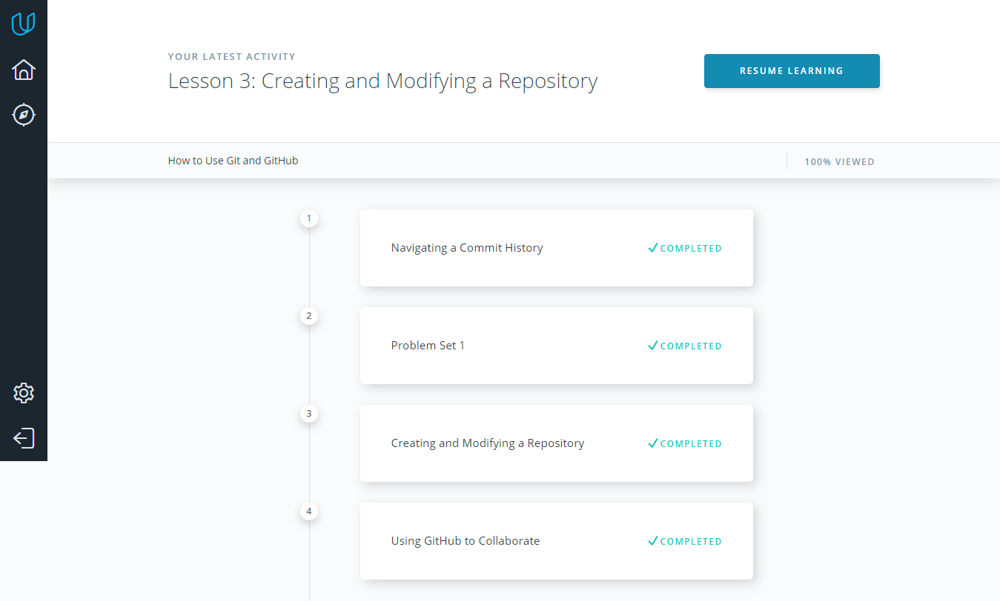
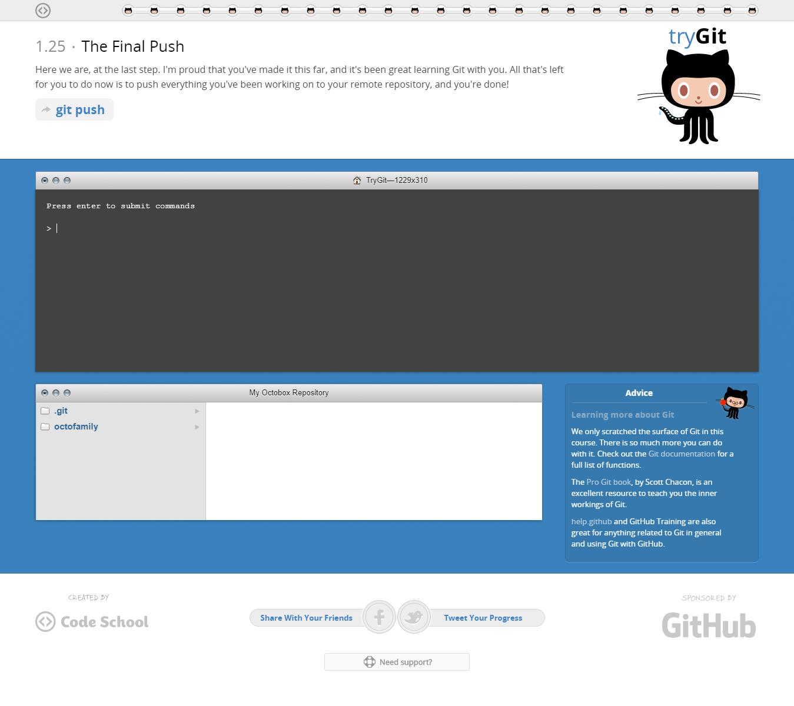
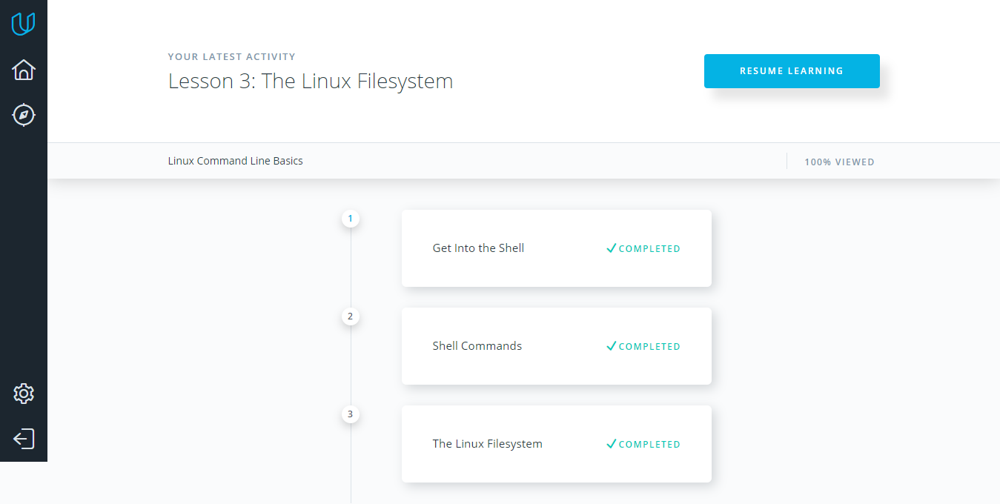
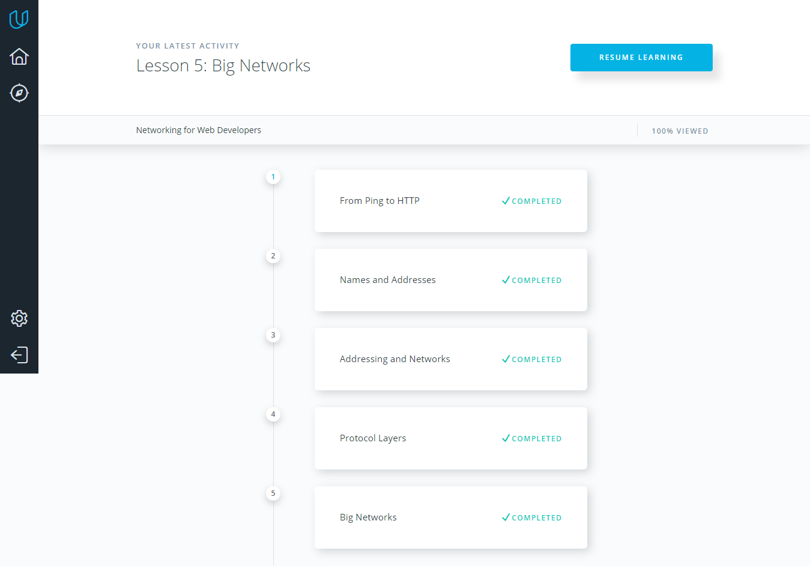

# Kottans Frontend Course
## Task 0 (get familiar with Git and GitHub):
**Here are my answers for three task questions:**
* New things that I have learned: making pull requests, git rebase command and working with local, remote repositories;
* The thing that surprised me was the capabilities of the git rebase;
* I think that in the future I will use the majority of git commands and github functionality, which I got acquainted with during the git courses.

### 1. How to use Git and GitHub:

### 2. try.github.io:

## Task 1:
1. Linux Command Line Basics:

2. Configuring Linux Web Servers:

3. Networking for Web Developers:

## Task 2:
1. What is Version Control:

2. GitHub & Collaboration:

