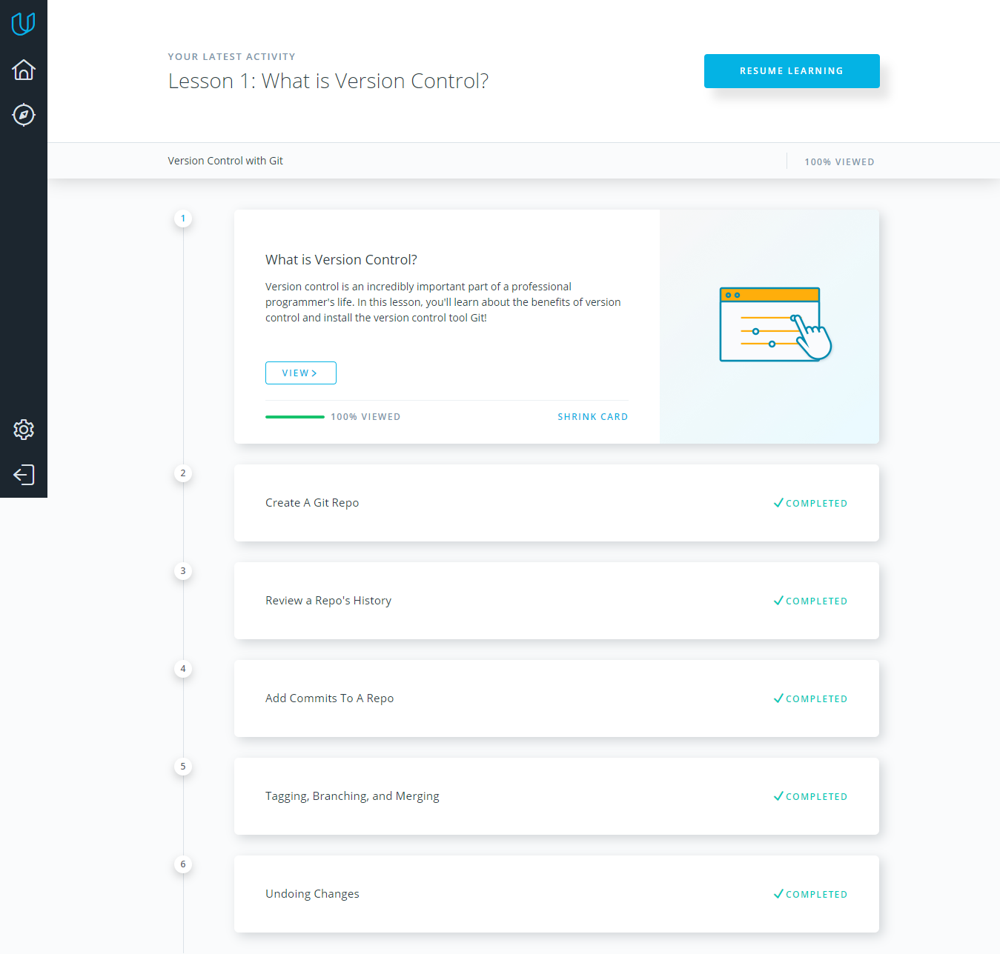
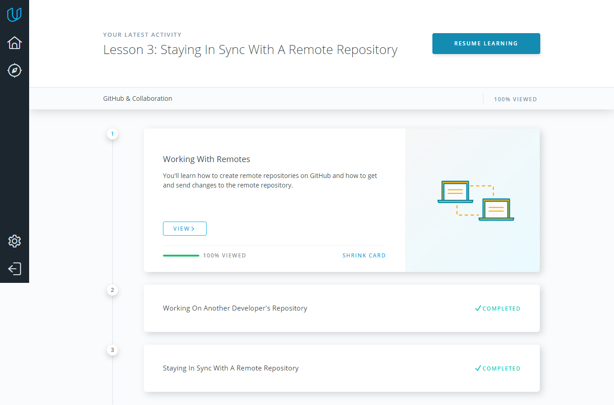

# Kottans Frontend Course
## Task 0 (get familiar with Git and GitHub):
**Here my answers for the three task questions:**
* New things for me was: making pull requests, git rebase command and also working with local, remote repositories;
* The things that surprised me was the capabilities of the git rebase;
* I think that in future I will use most of git commands and github functionality within the development workflow.

## Task 2:
1. What is Version Control:

2. GitHub & Collaboration:

